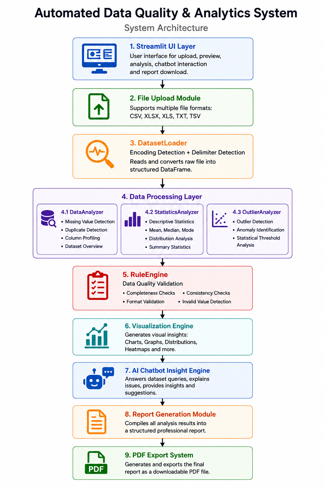

# Automated Data Quality & Analytics System

## Overview
The Automated Data Quality & Analytics System is an AI-powered Streamlit application that automates the complete data analysis lifecycle including dataset ingestion, cleaning, profiling, statistical analysis, visualization, AI chatbot interaction, and professional report generation. The system eliminates manual effort in understanding raw datasets and provides instant structured insights.

---

## Problem Statement
In traditional workflows, data analysts spend most of their time manually:
- Understanding dataset structure
- Detecting missing values and duplicates
- Identifying outliers and anomalies
- Performing statistical analysis
- Writing reports

These tasks are repetitive, slow, and error-prone. This system automates the entire pipeline from data upload to final reporting.

---

## Objective
To design and build an end-to-end automated system that:
- Loads multiple dataset formats
- Automatically detects encoding and structure
- Performs data quality analysis
- Generates statistical insights
- Provides AI chatbot-based explanations
- Produces downloadable professional reports

---

## System Architecture

---

## Architecture Explanation

### 1. Streamlit UI Layer
Provides an interactive web interface for:
- File upload
- Dataset preview
- Triggering analysis
- Chatbot interaction
- Report download

---

### 2. File Upload Module
Handles multiple dataset formats:
- CSV
- XLSX / XLS
- TXT
- TSV

Uploaded files are processed as in-memory objects for efficient handling.

---

### 3. DatasetLoader Module
Responsible for intelligent data ingestion:
- Detects file encoding automatically using statistical analysis
- Identifies correct delimiter (comma, semicolon, pipe, tab)
- Converts raw file into structured pandas DataFrame
- Ensures compatibility across multiple file types

This removes the need for manual preprocessing.

---

### 4. Data Processing Layer

#### DataAnalyzer
- Identifies missing values
- Detects duplicate records
- Analyzes column structure
- Provides dataset overview

#### StatisticsAnalyzer
- Generates descriptive statistics
- Computes mean, median, mode
- Analyzes distribution patterns

#### OutlierAnalyzer
- Detects abnormal values in numeric columns
- Identifies data anomalies using statistical thresholds

---

### 5. RuleEngine (Data Quality Validation)
Applies automated rules to evaluate dataset quality:
- Completeness checks
- Validity checks
- Consistency checks
- Format validation

Outputs structured data quality issues.

---

### 6. Visualization Engine
Generates visual insights such as:
- Missing value distribution charts
- Outlier plots
- Column-wise statistical graphs
- Data distribution visualization

These visualizations help in quick understanding of dataset health.

---

### 7. AI Chatbot Insight Engine
An integrated chatbot interface that allows users to:
- Ask questions about dataset
- Get instant summaries
- Understand data issues in simple terms
- Receive recommendations for fixing problems

The chatbot provides short, structured, and actionable responses instead of long explanations.

---

### 8. Report Generation Module
Converts analysis results into a structured professional report:
- Dataset summary
- Data quality issues
- Statistical insights
- Key findings
- Final conclusion

The report is formatted for business and technical stakeholders.

---

### 9. PDF Export System

Generates downloadable reports in PDF format. 

---

## Key Features

- Fully automated dataset analysis pipeline
- Multi-format file support
- Intelligent encoding and delimiter detection
- Rule-based data quality assessment
- Outlier detection system
- Interactive AI chatbot for insights
- Automated visualization generation
- Professional PDF report generation
- Dynamic file naming system
- No manual data cleaning required

---

## Benefits

- Reduces manual data analysis effort significantly
- Eliminates repetitive preprocessing tasks
- Improves data understanding speed
- Helps non-technical users analyze datasets
- Provides structured and consistent reporting
- Enhances decision-making through quick insights
- Reduces dependency on data engineers for basic analysis

---

## Technologies Used

- Python
- Streamlit
- Pandas
- NumPy
- Chardet
- Matplotlib / Visualization libraries
- ReportLab (PDF generation)

---

## Workflow Summary

1. User uploads dataset
2. System automatically detects format and loads data
3. Data is analyzed for quality issues and statistics
4. Outliers and inconsistencies are detected
5. Visual insights are generated
6. AI chatbot provides explanations
7. Final report is generated
8. User downloads PDF report

---

## Conclusion

The Automated Data Quality & Analytics System provides an end-to-end solution for dataset understanding and analysis. It removes the need for manual inspection, reduces time spent on data cleaning, and delivers structured insights through automation and AI. This system enables faster and more reliable data-driven decision-making across use cases.